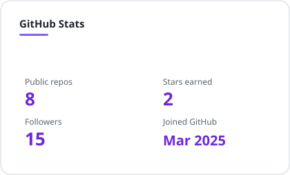
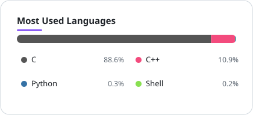

  
  
  

  

## 🚀 About me

- 🔧 Building a **smartwatch prototype** on ESP32-S3 with a 2.06" AMOLED touchscreen (Waveshare)
- 🖥️ Designing touch UIs with **LVGL** — round-screen layouts, complications, double buffering
- ⚙️ Automating everything with **Bash** and **Python**
- 📡 PlatformIO + Arduino framework, I²C/QSPI peripherals, PMUs, IMUs, audio codecs

## 🛠 Featured projects

| Project | What it is |
| --- | --- |
| [ESP32-S3-Touch-AMOLED-2.06](https://github.com/xISPx/ESP32-S3-Touch-AMOLED-2.06) | Smartwatch firmware: 2.06" AMOLED, LVGL, AXP2101 PMU, IMU, audio codec |
| [WT32_SC01_Plus_LVGL](https://github.com/xISPx/WT32_SC01_Plus_LVGL) | LVGL 9 demo on the WT32-SC01 Plus touch display |
| [Image-Converter](https://github.com/xISPx/Image-Converter) | Python CLI for batch image conversion and resizing |
| [lamp-automation](https://github.com/xISPx/lamp-automation) | One-shot LAMP stack installer for Ubuntu |

## ⚡ Tech stack

  <picture>
    <source media="(prefers-color-scheme: dark)" srcset="https://skillicons.dev/icons?i=c%2Ccpp%2Cpython%2Cbash%2Carduino%2Clinux%2Cgit&theme=dark"/>
    
  </picture>

  
  
  
  

## 📊 GitHub stats

  
  

  <picture>
    <source media="(prefers-color-scheme: dark)" srcset="https://streak-stats.demolab.com?user=xISPx&hide_border=true&theme=tokyonight&locale=en"/>
    
  </picture>

*Cards above refresh daily via GitHub Actions.*

## 🐍 Contribution snake

  <picture>
    <source media="(prefers-color-scheme: dark)" srcset="https://raw.githubusercontent.com/xISPx/xISPx/output/github-contribution-grid-snake-dark.svg"/>
    
  </picture>

  

