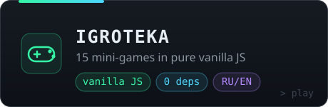
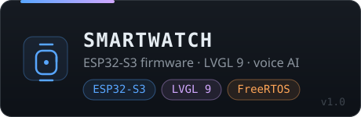
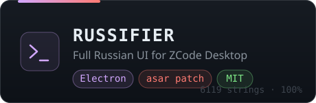

<b>English</b> · <a href="README.ru.md">Русский</a>

  

## Projects

  

## Stack

  

## GitHub stats

  
  

  <picture>
    <source media="(prefers-color-scheme: dark)" srcset="https://raw.githubusercontent.com/xISPx/xISPx/output/github-contribution-grid-snake-dark.svg"/>
    
  </picture>

Cards refresh daily via GitHub Actions · 

